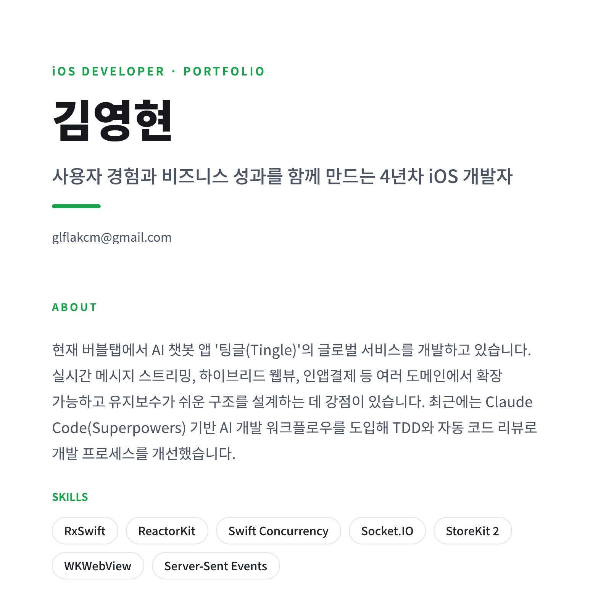
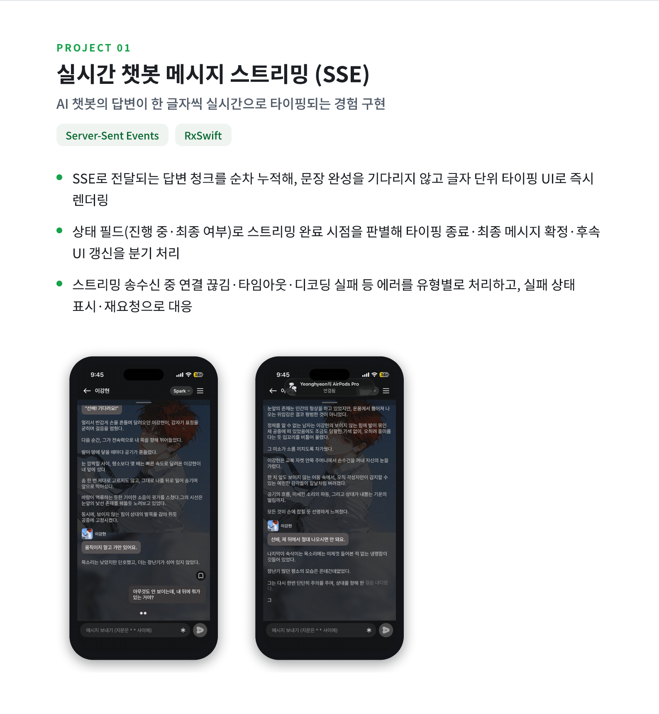
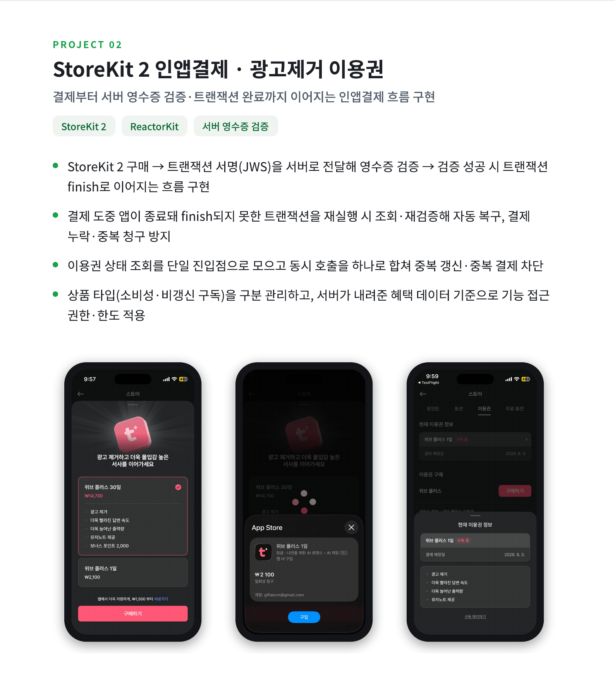
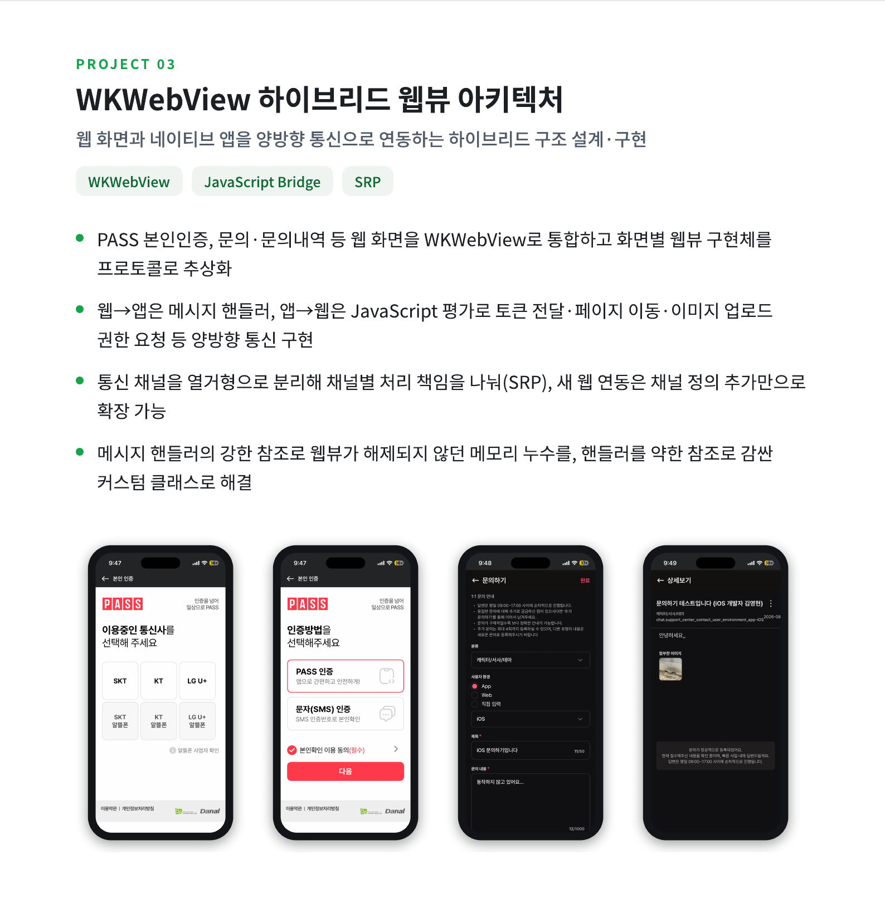
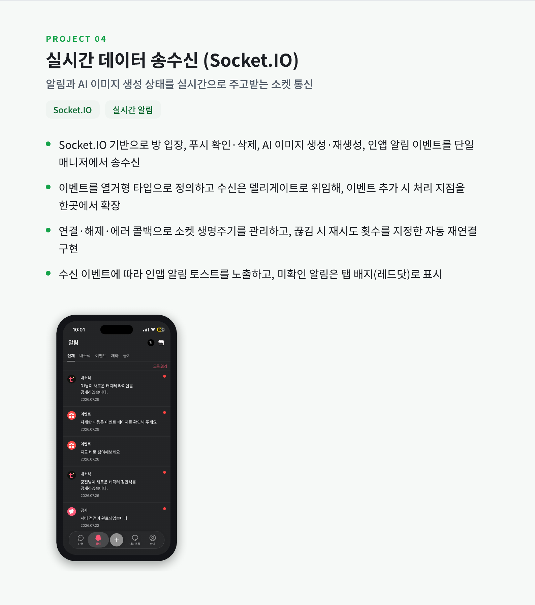
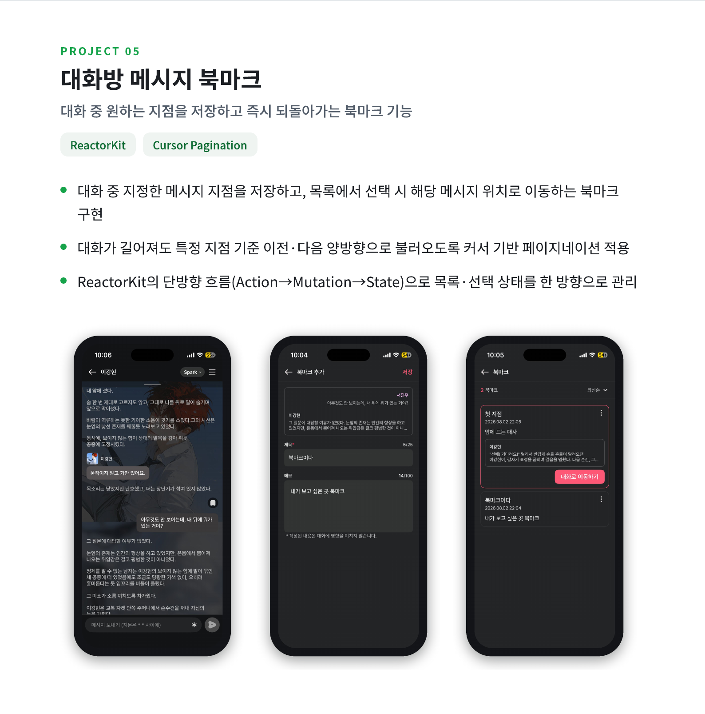
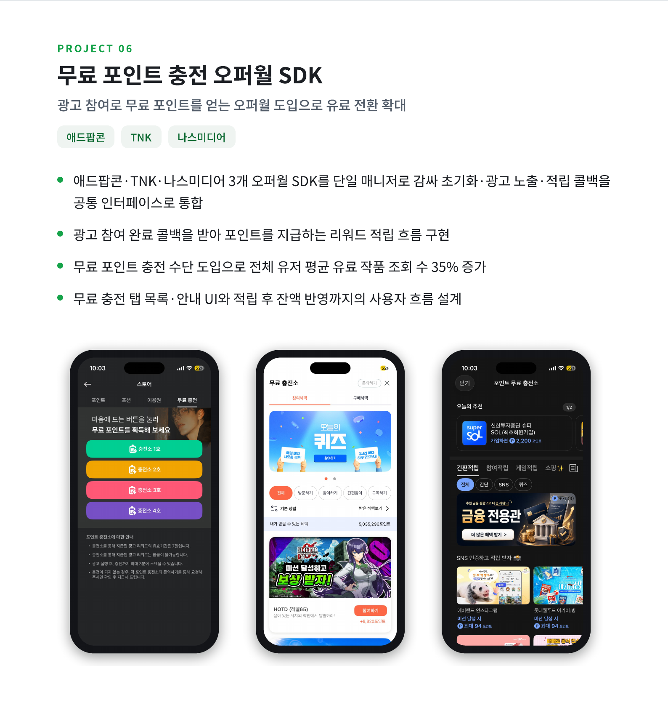
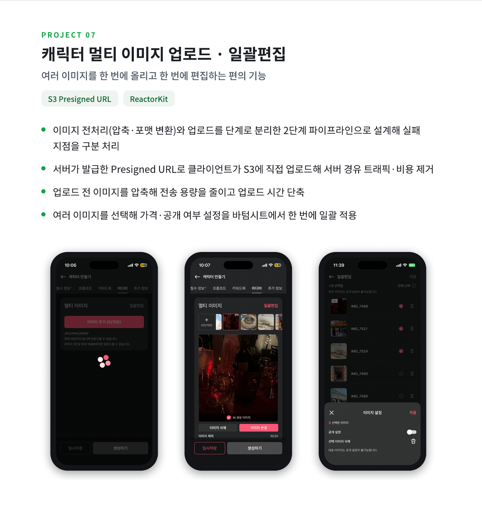
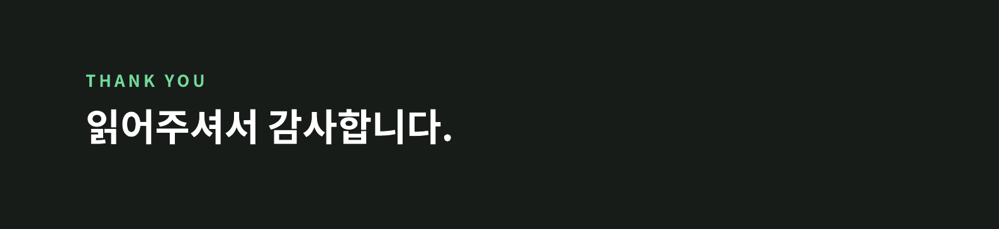

# iOS 개발자 포트폴리오 · 김영현

사용자 경험과 비즈니스 성과를 함께 만드는 4년차 iOS 개발자입니다.

📄 [PDF로 보기 / 다운로드](./%E1%84%80%E1%85%B5%E1%86%B7%E1%84%8B%E1%85%A7%E1%86%BC%E1%84%92%E1%85%A7%E1%86%AB_iOS_%E1%84%91%E1%85%A9%E1%84%90%E1%85%B3%E1%84%91%E1%85%A9%E1%86%AF%E1%84%85%E1%85%B5%E1%84%8B%E1%85%A9.pdf) · ✉️ glflakcm@gmail.com

---

